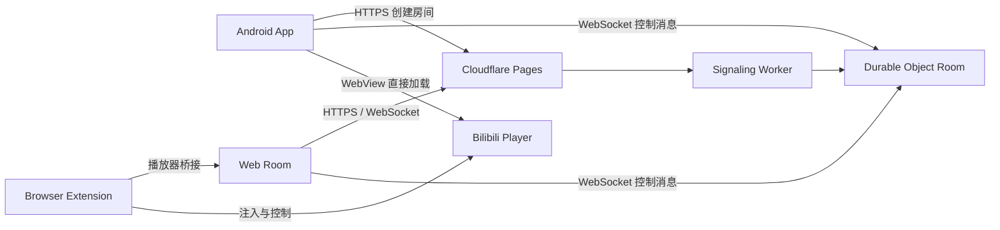

# 同看（Tongkan）项目上下文总入口

> 作用：保存不会因一次开发任务结束而失效的项目背景、目录地图、文档导航和 AI 工作方法。
> 动态状态请看 `CONTEXT.md`；长期决策请看 `DECISIONS.md`；执行规则请看 `AGENTS.md`。
> 最后核对：2026-08-10。

## 1. 新对话启动顺序

任何 AI 或开发者开始新对话时，按以下顺序读取：

1. `AGENTS.md`：确认工作规则、技能路由、安全约束和构建方式。
2. `CONTEXT.md`：确认当前版本、进行中任务、已知问题、最近完成事项和下一步。
3. `PROJECT_CONTEXT.md`：确认产品目标、仓库地图、架构和文档真源。
4. `DECISIONS.md`：如果任务涉及产品范围、协议、架构、UI 或版本规划，读取相关决策。
5. 根据“任务到文档映射”读取对应 PRD、设计规范、部署或 QA 文档。
6. 修改前检查 `git status --short`，确认工作区是否已有未提交改动。

不要只读 `README.md` 就开始开发。README 面向使用者，可能不会记录最新开发上下文。

## 2. 文档分工

| 文件 | 角色 | 更新时机 |
|---|---|---|
| `AGENTS.md` | AI 执行规则和项目工作协议 | 工作方法、工具规则或生命周期变化时 |
| `PROJECT_CONTEXT.md` | 稳定项目背景、目录地图、架构和文档索引 | 仓库结构、产品边界或真源发生长期变化时 |
| `CONTEXT.md` | 当前开发快照和跨对话交接 | 每次对话结束前必须更新 |
| `DECISIONS.md` | 已确认的长期产品与技术决策 | 用户确认重要选择或旧决策被替代时 |
| `PRD.md` | 同看整体产品需求和 1.0 范围 | 整体产品范围改变时 |
| `ANDROID_FOLLOWUP_PRD.md` | Android 后续版本、体验反馈和 Alpha 9+ 讨论 | Android 产品决定或界面范围改变时 |
| `design/alpha9-ui/SELECTED_DESIGN.md` | Android Alpha 9 已选视觉方向和 UI Token | Android 视觉、交互、主题规则改变时 |
| `design.md` | Web 跨页面统一设计系统 | Web 视觉、结构、主题或组件规则改变时 |
| `QA_CHECKLIST.md` | 发布验收清单 | 新增需回归的能力时 |
| `DEPLOYMENT.md` | 公网部署和移动端路线 | 部署方式、域名或环境变量改变时 |

### 冲突处理顺序

发生冲突时按以下优先级处理：

1. 用户在当前对话中的明确要求。
2. `AGENTS.md` 的执行和安全规则。
3. `DECISIONS.md` 中状态为“已接受”的长期决策。
4. `CONTEXT.md` 中最新的当前状态。
5. 对应 PRD、设计规范、部署和 QA 文档。
6. README 或历史分析文档。

如果代码行为与文档不一致，不要直接假定代码正确；先判断代码是当前实现、历史实验还是未完成改动。

## 3. 产品定义

同看是一个供两个人同步观看视频的个人工具，当前重点是 B站视频同步。

核心价值：

- 不注册、不登录，通过临时房间密钥让两个人进入同一房间。
- 服务器只同步播放控制状态，不中转 B站视频流。
- 双方同步播放、暂停、进度、倍速和视频切换。
- Android 客户端重点优化创建/加入房间、选择视频、全屏观看和长期片单体验。

当前非目标：

- 多人群组房间。
- 账号体系、云收藏和社交关系。
- Android 屏幕共享、语音和聊天。
- 服务端转码或视频内容中继。
- 用 Compose、Kotlin 或大型新框架重写 Android。

## 4. 当前开发基线

动态版本以 `CONTEXT.md` 为准。必须区分“当前稳定版本”和“下一开发目标”：

- 当前真机测试版本：Android `1.0.0-alpha.9.2`，`versionCode 11`。
- 安装包真源：GitHub Release `v1.0.0-alpha.9.2`；本地 `release/` 仅作为构建中转目录，不提交 Git。
- 下一开发目标：先收集 Alpha 9.2 使用反馈，再推进互动表情/聊天或 Alpha 10 本地片单。
- Alpha 8：直接加载 B站移动页面的实验版本，已归档，不作为当前方案。
- 当前播放器路线：桌面 UA + 独立 Embed + Android Bridge，已通过 Alpha 9.2 真机测试。

## 5. 仓库目录地图

```text
同步观看视频/
├─ apps/
│  ├─ signaling/       Cloudflare Worker + Durable Objects 房间信令
│  ├─ web/             React + Vite 房间网页和自测页
│  ├─ extension/       Chrome/Edge MV3 B站播放器注入扩展
│  └─ android/         原生 Java + WebView Android 客户端
├─ packages/
│  └─ protocol/        Web/信令共享 TypeScript 协议和媒体类型
├─ design/
│  └─ alpha9-ui/       Alpha 9 视觉研究、交互原型和截图
├─ qa/                 协议契约、测试记录和 QA 模板
├─ scripts/            构建、发布、本地信令和辅助脚本
├─ release/            APK、网页和扩展发布产物
├─ AGENTS.md            AI 工作规则
├─ PROJECT_CONTEXT.md   本文件：稳定项目地图和文档索引
├─ CONTEXT.md           当前开发快照
├─ DECISIONS.md         产品与架构决策日志
├─ design.md            Web 跨页面统一设计系统
├─ PRD.md               整体产品需求
└─ ANDROID_FOLLOWUP_PRD.md Android 后续产品与体验讨论
```

## 6. 系统架构



关键原则：

- Durable Object 保存房间成员、当前媒体、播放锚点和缓冲状态。
- `media-change` 负责切换当前视频；播放列表第一版保存在 Android 本机，不进入房间协议。
- WebView 加载 B站播放器，JavaScript Bridge 读取和控制播放器状态。
- 房间协议是跨 Web、扩展和 Android 的公共契约，改动必须同步测试。

## 7. 任务到目录和文档映射

| 任务 | 首先阅读 | 主要代码或目录 |
|---|---|---|
| Android UI、主题、全屏、片单 | `ANDROID_FOLLOWUP_PRD.md`、`design/alpha9-ui/SELECTED_DESIGN.md` | `apps/android/app/src/main/java/com/tongkan/mobile/MainActivity.java` |
| Android 房间连接和重连 | `CONTEXT.md`、Android README | `RoomClient.java` |
| B站链接解析和播放器 URL | `CONTEXT.md` 已知问题 | `BilibiliMedia.java`、`bilibili-player-bridge.js` |
| 播放协议 | `DECISIONS.md`、`packages/protocol/src/types.ts` | `RoomProtocol.java`、`room-session.ts` |
| Cloudflare 房间逻辑 | `DEPLOYMENT.md`、`PRD.md` | `apps/signaling/src/` |
| Web 房间 UI | `design.md`、`PRD.md`、`ACCESSIBILITY_AUDIT.md` | `apps/web/src/`、`tokens.css` |
| 浏览器扩展 | `apps/extension/README.md` | `apps/extension/` |
| UI 预览 | `design/alpha9-ui/SELECTED_DESIGN.md` | `design/alpha9-ui/preview.html`、`playlist-preview.html` |
| APK 构建 | `apps/android/README.md`、`AGENTS.md` | `scripts/run-android-gradle.mjs`、`release/` |
| 发布验收 | `QA_CHECKLIST.md` | `qa/`、各测试命令 |
| 崩溃和历史事故 | `.crash-analysis.md`、`.roomclient-loss-analysis.md` | 对应 Android 网络与生命周期代码 |

## 8. Android 关键文件

```text
apps/android/app/src/main/java/com/tongkan/mobile/
├─ MainActivity.java        动态构建 UI、WebView、播放器桥接和界面状态
├─ RoomClient.java          HTTP 创建房间、OkHttp WebSocket、重连和事件分发
├─ RoomProtocol.java        Android 端消息构造
├─ BilibiliMedia.java       BV/AV/b23.tv 解析和播放器地址
└─ PlaybackAnchor.java      房间播放锚点解析

apps/android/app/src/main/assets/
└─ bilibili-player-bridge.js 播放器 JavaScript Bridge
```

Android 约束：

- Java 17、minSdk 26、compileSdk 35。
- 不引入 Kotlin、Compose 或新的架构框架。
- 当前网络依赖为 OkHttp 4.12.0。
- 中文路径可能导致 Gradle 问题，构建使用 `C:\tmp\android-build\project`。

## 9. 常用命令

```powershell
pnpm install
pnpm dev:signaling
pnpm dev:web
pnpm test
pnpm test:integration
pnpm typecheck
pnpm android:check
pnpm android:build
pnpm build
```

Android 临时构建环境和完整复制命令以 `AGENTS.md`、`apps/android/README.md` 为准。

## 10. 文档维护规则

### 每次对话必须更新 `CONTEXT.md`

至少维护：

- `last_updated`
- `current_version`
- `target_version`（存在下一开发版本时）
- `status`
- Completed / In Progress
- Known Issues
- Next Steps
- Conversation Log

### 何时更新 `DECISIONS.md`

以下情况必须写入：

- 用户确认产品范围、默认行为或交互方式。
- 选择或替换架构、依赖、协议和存储方式。
- 确认长期视觉规则，例如主题、圆角或导航结构。
- 明确放弃一个实验方案或将其恢复为基线。

决策不得直接删除。旧决策被替代时标记“已取代”，并链接到新决策编号。

### 何时更新 `PROJECT_CONTEXT.md`

只有稳定信息改变时更新，例如：

- 仓库目录调整。
- 产品核心目标或非目标改变。
- 新增主要客户端或服务。
- 文档真源和工作流程改变。

不要把每次对话的临时进度堆进本文件。

## 11. 新对话交接检查表

开始工作前：

- [ ] 已读 `AGENTS.md`
- [ ] 已读 `CONTEXT.md`
- [ ] 已读 `PROJECT_CONTEXT.md`
- [ ] 已检查相关 `DECISIONS.md`
- [ ] 已确认当前版本和工作区状态
- [ ] 已找到任务对应的代码和文档

结束对话前：

- [ ] 已更新 `CONTEXT.md`
- [ ] 新长期决定已写入 `DECISIONS.md`
- [ ] 产品范围变化已同步对应 PRD
- [ ] 设计变化已同步 `SELECTED_DESIGN.md`
- [ ] 已记录测试、构建结果和产物路径
- [ ] 没有把实验版本误写成稳定基线

## 12. 术语

| 术语 | 含义 |
|---|---|
| 房间 | 最多两人的临时同步会话 |
| 房主 / 访客 | 创建房间的人和通过邀请链接加入的人 |
| 播放锚点 | 服务端保存的媒体、位置、暂停状态、倍速和时间基准 |
| Bridge | Android/WebView 或扩展与真实播放器之间的控制脚本 |
| 本地片单 | 只保存在 Android 手机、跨房间和重启保留的视频列表 |
| 当前媒体 | 房间此刻同步播放的视频，属于协议状态 |
| Alpha 7 | 当前 Android 安全回退基线 |
| Alpha 9 | 下一开发版本：核心房间与观看体验，不包含完整本地片单 |
| Alpha 10 | 完整 Android 本地长期片单里程碑 |

## 13. 当前最重要的导航

- 当前开发状态：`CONTEXT.md`
- 已确认决策：`DECISIONS.md`
- Android 后续 PRD：`ANDROID_FOLLOWUP_PRD.md`
- Alpha 9 已选设计：`design/alpha9-ui/SELECTED_DESIGN.md`
- Alpha 9 主界面原型：`design/alpha9-ui/preview.html`
- 本地片单原型：`design/alpha9-ui/playlist-preview.html`
- Android 构建说明：`apps/android/README.md`
- 发布验收：`QA_CHECKLIST.md`