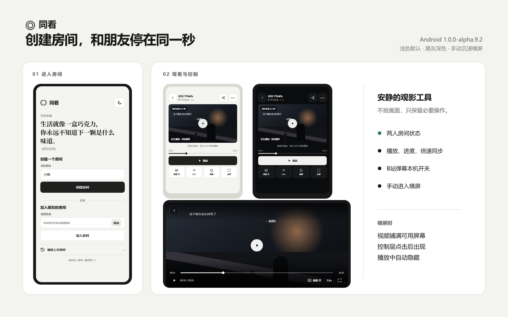

# 同看

给两个人自用的同步观看工具。房间不要求注册，B站是基础媒体链路，双方都能播放、暂停、拖动进度、改变倍速或切换视频；所有控制命令由服务端分配递增序号，后到达服务端的命令覆盖先到达的命令。

[](https://github.com/dengbingmei24-web/tongkan/actions/workflows/ci.yml)
[](https://github.com/dengbingmei24-web/tongkan/actions/workflows/android.yml)

## 立即使用

- [🌐 打开在线网页版](https://tongkan-personal.pages.dev)
- [📱 下载 Android 1.0.0-alpha.9.2](https://github.com/dengbingmei24-web/tongkan/releases/tag/v1.0.0-alpha.9.2)
- [📝 查看版本更新](./CHANGELOG.md)
- [🚀 查看后续发布方式](./RELEASING.md)

> 推荐选择：两部 Android 手机同步看 B站时使用 App；电脑端临时创建房间、聊天、屏幕共享或同步视频直链时可以直接使用网页版。

## Android 界面

下面这张产品展示图统一呈现 **Android 1.0.0-alpha.9.2** 已实现的入口、浅色观看、深色观看和沉浸横屏状态。实际视频画面与 B站弹幕会随所选视频变化。



> 默认使用浅色主题；深色主题为中性黑灰。绿色只表示在线或成功状态，横屏由用户手动进入，播放控制会在无操作时自动隐藏。
## 怎么使用

### Android App：两部手机同步看 B站

1. 两个人分别从 [GitHub Release](https://github.com/dengbingmei24-web/tongkan/releases/tag/v1.0.0-alpha.9.2) 下载并安装 APK；最低支持 Android 8.0。
2. 房主填写昵称并点击“创建房间”，App 会自动弹出系统分享面板。
3. 朋友打开同看 App，把收到的邀请链接粘贴到“加入朋友的房间”，然后点击“加入房间”。
4. 任意一方在“准备视频”页面粘贴 B站完整链接、BV 链接或 b23.tv 分享链接，再点击“准备视频”。
5. 视频准备成功后会自动进入观看页，并停在 0 秒等待手动播放。
6. 双方均可播放、暂停、拖动进度和切换倍速；弹幕开关保存在各自手机上。
7. 需要横屏时手动点击“横屏”；横屏控制栏会自动隐藏，点击画面可再次显示。

### 在线网页版：无需安装 App

1. 打开 [tongkan-personal.pages.dev](https://tongkan-personal.pages.dev)，填写昵称并创建房间。
2. 把页面生成的邀请链接发给朋友；朋友打开链接并填写昵称加入。
3. 浏览器可以直接播放的 MP4/WebM 等视频直链，不安装扩展也能同步播放、暂停和进度。
4. 两台电脑使用 Chrome 或 Edge 时，可以聊天和发起屏幕共享；共享标签页时可选择共享标签页音频。
5. 电脑网页要完整同步 B站播放器，需要加载本仓库的浏览器扩展；手机网页中的 B站画面目前只能本地观看，不会与房间同步。

### 各版本能力

| 使用方式 | B站双向同步 | 视频直链 | 聊天 | 屏幕共享 | 推荐场景 |
| --- | --- | --- | --- | --- | --- |
| Android App | 支持 | 暂不作为主要入口 | 暂未加入 | 暂未加入 | 两部手机一起看 B站 |
| 电脑网页 + 扩展 | 支持 | 支持 | 支持 | 支持 | 电脑双人观看与共享屏幕 |
| 电脑网页（无扩展） | 不支持 B站控制 | 支持 | 支持 | 支持 | 直链视频、聊天、屏幕共享 |
| 手机网页 | B站仅本地观看 | 支持浏览器可播放直链 | 支持 | 只能观看电脑共享 | 临时加入房间或观看共享画面 |

## 项目上下文与 AI 入口

长期开发和换对话时，从以下文件进入：

1. [`CONTEXT.md`](./CONTEXT.md)：当前版本、正在进行的工作、已知问题和下一步。
2. [`PROJECT_CONTEXT.md`](./PROJECT_CONTEXT.md)：产品目标、完整目录地图、架构、关键文件和文档导航。
3. [`DECISIONS.md`](./DECISIONS.md)：已经确认的长期产品、设计和技术决策。
4. [`AGENTS.md`](./AGENTS.md)：AI 的强制工作规则、构建方式和安全约束。

任务文档入口：Android 后续开发看 [`ANDROID_FOLLOWUP_PRD.md`](./ANDROID_FOLLOWUP_PRD.md)，整体产品范围看 [`PRD.md`](./PRD.md)，Alpha 9 设计看 [`design/alpha9-ui/SELECTED_DESIGN.md`](./design/alpha9-ui/SELECTED_DESIGN.md)。

> `CONTEXT.md` 是动态交接真源；不要根据 README 中的历史描述判断当前版本。

## 当前可运行范围

- React 房间网页：创建、邀请、加入、双方状态、公共播放控制、聊天。
- Cloudflare Durable Objects 信令：固定两人槽位、私密密钥、权威序号、限流、播放锚点持久化。
- Chrome / Edge Manifest V3 扩展：连接房间网页与内嵌 B站 HTML5 播放器，支持本地操作上报、远端命令抑制、视频和分 P 导航。
- 直链视频同步：将浏览器可直接播放的 HTTP/HTTPS 视频地址载入房间，双方在内置播放器中播放、暂停、拖动和双击切换状态。
- 断线自动恢复：网页刷新、短暂掉线或网络切换后自动重新认证，并按服务端保存的视频、播放状态和当前进度重新对齐。
- 桌面屏幕共享基础链路：Chrome / Edge 使用 `getDisplayMedia` 捕获标签页、窗口或屏幕，WebRTC 双人点对点传输画面与可用的共享声音。
- Android 1.0 Alpha：两部 Android 手机加入同一 Cloudflare 房间，在 App 内载入 B站播放器，双方均可播放、暂停、拖动，显示真实时长，并在断线后恢复服务端最新状态。
- 共享协议包：B站链接解析、时钟锚点、漂移校准策略。

语音和 Android 屏幕共享位于后续开发阶段；Android 1.0 已进入可安装 Alpha 阶段（见 `apps/android/`），不会阻塞 B站双人同步与桌面屏幕共享链路。

### Android 1.0 Alpha

Android 工程位于 [`apps/android`](./apps/android)，使用原生 Java、受控 WebView 和 JavaScript Bridge，直接复用现有 Cloudflare Durable Objects 房间服务与播放协议。Android 1.0 不包含手机屏幕共享、语音、聊天和桌面扩展互通验收。

当前通过真机测试的版本是 **Android `1.0.0-alpha.9.2`（versionCode 11）**。

- [下载 Alpha 9.2 APK](https://github.com/dengbingmei24-web/tongkan/releases/tag/v1.0.0-alpha.9.2)
- [查看全部 GitHub Releases](https://github.com/dengbingmei24-web/tongkan/releases)
- [查看版本变更记录](./CHANGELOG.md)

最低系统版本为 Android 8.0（API 26）。Debug APK 使用 Android 调试证书签名，只用于个人安装测试；以后发布正式版时需要改用长期保存的 Release 签名。

本地完整检查：

```powershell
pnpm android:check
```

该命令依次运行 Android 单元/协议测试、Lint 和 APK 构建。详细环境与输出位置见 [`apps/android/README.md`](./apps/android/README.md)。

### 版本与发布方式

- 源码和文档保存在 Git 提交历史中，不删除或覆盖旧提交。
- APK 不直接提交到仓库，统一放在 GitHub Releases 中。
- 每个版本使用不可重复的标签，例如 `v1.0.0-alpha.9.2`。
- 推送 `v*` 标签后，GitHub Actions 会自动测试、构建 APK、生成 SHA-256 并创建预发布版。
- 完整发布步骤见 [`RELEASING.md`](./RELEASING.md)。

## 本地启动

需要 Node.js 22+ 与 pnpm 11。仓库通过 `.node-version` 固定主版本，并在 CI 中使用 `pnpm@11.9.0`。

```powershell
pnpm install
Copy-Item .env.example apps\web\.env.local
pnpm dev:signaling
```

另开一个终端：

```powershell
pnpm dev:web
```

打开 `http://localhost:5173`。

### B站链接同步

1. 支持完整 `bilibili.com/video/BV...` 链接、`b23.tv` 分享短链，以及包含链接的整段分享文案。
2. 解析出 BV 号后，房间会载入 B站官方嵌入播放器；Edge / Chrome 扩展直接注入该播放器的 iframe，同步原生播放、暂停、进度和倍速操作。
3. 两位参与者都需要加载 `apps/extension/dist`。扩展代码更新后，要在扩展管理页点击“重新加载”，然后刷新房间页。
4. 房间显示“浏览器扩展：未检测到（B站需要）”时，嵌入画面仍可本地观看，但播放、暂停和拖动还不能双向同步。
5. `b23.tv` 会先通过独立 B站页面完成跳转；扩展识别真实 BV 号并回写房间后，双方自动切换到房间内嵌播放器。

### 直链视频同步

创建房间时或进入房间后，在“载入视频”中粘贴 MP4、WebM 等浏览器可直接访问的视频地址。双方会加载同一地址，并复用房间的权威播放锚点：

1. 点击播放器中央按钮，或在画面空白处连续轻点两次，切换播放与暂停。
2. 双方都可以拖动播放器底部进度条；松开后最终位置同步给另一方。
3. 地址需要允许浏览器直接访问。带登录 Cookie、防盗链、DRM 或已过期签名的地址可能无法播放，此时使用屏幕共享。
4. 当前基础版本优先支持 MP4、WebM 等浏览器原生格式；HLS 是否可播取决于浏览器原生能力。

### 断线重连与状态恢复

- 网页连接中断后会按 0.5、1、2、4、8 秒逐步重试，恢复后重新读取房间权威快照。
- 刷新页面或晚于对方进入房间时，会恢复当前视频、播放/暂停状态、倍速和按服务器时间推算的进度。
- 重连期间播放器控制会暂时禁用，避免产生无法同步的本地操作；连接恢复后自动重新开放。
- 网络恢复在线时会立即重试，也可以点击房间底部的“立即重新连接”。
- 浏览器若阻止刷新后的自动播放，页面会保留正确进度并提示手动点击一次播放。这属于浏览器自动播放策略，不会丢失房间状态。

### 桌面屏幕共享

两人加入同一房间后，任意一方点击房间底部的“共享屏幕”：

1. 选择浏览器标签页、窗口或整个屏幕。
2. 共享标签页时，勾选浏览器提供的“共享标签页音频”。
3. 对方页面会自动建立 WebRTC P2P 连接并显示画面。
4. 共享者点击“停止共享”，或使用浏览器原生的停止按钮，双方会回到 B站同步模式。

默认使用公共 STUN，不部署媒体中继。部分公司网、校园网、移动网络或严格 NAT 可能无法直连；15 秒后页面会显示诊断。需要 TURN 时，按仓库根目录的 [`.env.example`](./.env.example) 配置 Web 环境变量。环境变量名称、默认值和格式只在该文件维护，部署文档不再复制另一份配置清单。

### 单机双端自测

信令服务与网页同时启动后，打开 `http://localhost:5173/self-test`。页面会在同一个浏览器标签中创建房主与访客两个独立客户端，并提供：

- 一键执行 7 项真实双端验收，包括双方控制、服务端排序、漂移硬校准、缓冲联动暂停和断线恢复。
- 左右两个虚拟播放器，可分别手动播放、暂停、跳转、改倍速、切换 BV/分 P、模拟缓冲或断线重连。
- 实时显示服务序号、投影位置、本地位置、偏差和校准方式。

这个页面不读取 B站真实播放器，因此适合在无法安装扩展或没有第二台电脑时验证房间基础链路；最终发布前仍应补做一次真实 B站双端联调。

信令服务运行时，也可以不打开浏览器，直接执行同一套七项验收：

```powershell
pnpm test:self
```

也可以让脚本自动启动临时 Wrangler 信令服务，并依次执行底层 WebSocket smoke test 与上述七项双端验收。CI 使用的就是这条命令：

```powershell
pnpm test:integration
```

如果 Edge 无法被自动控制，可以直接运行扩展协议级联调。它会加载真实的网页桥接、扩展后台和 B站内容脚本，在本地模拟两个标签页，验证权威播放状态下发、双方播放/暂停/跳转/倍速、缓冲上报、换 BV 复用标签页，以及 Manifest V3 后台休眠重启后的自动恢复：

```bash
pnpm test:bridge
```

### 单机真实 B站联调

浏览器扩展已经加载时，打开 `/self-test` 后会出现“接入一个真实 B站标签页”：

1. 点击“房主接入”或“访客接入”。
2. 扩展会打开或复用权威状态中的 BV/分 P 页面。
3. 在 B站播放器里播放、暂停、拖动或改变倍速；事件会进入所选席位，再由房间服务分配新序号并同步到另一侧。
4. 再次点击已选席位即可退出真实模式，恢复纯虚拟双端测试。

这个模式只把一个席位连接到真实播放器，另一席位继续由自测页模拟，因此仍然只需要一台电脑。

## 加载浏览器扩展

```powershell
pnpm --filter @tongkan/extension build
```

在 Chrome 或 Edge 的扩展管理页开启开发者模式，选择“加载已解压的扩展程序”，目录为 `apps/extension/dist`。完整 BV 链接会在房间内播放；只有解析 `b23.tv` 短链或使用“独立打开”后才需要额外保留 B站页面。

## 验证

```powershell
pnpm test
pnpm typecheck
pnpm build
pnpm test:integration
```

发布前还应按 [`QA_CHECKLIST.md`](./QA_CHECKLIST.md) 完成真实双浏览器、B站播放器和屏幕共享验收；自动化测试不能替代浏览器权限、标签页音频和跨网络 WebRTC 测试。

每次验收的实际环境、结果和失败证据使用 [`qa/TEST_RUN_TEMPLATE.md`](./qa/TEST_RUN_TEMPLATE.md) 单独记录，避免直接修改通用清单。

信令服务部署前可运行 `pnpm --filter @tongkan/signaling build` 做 Wrangler dry-run；正式部署使用 `pnpm --filter @tongkan/signaling exec wrangler deploy`，然后将网页环境变量指向部署后的 HTTPS/WSS 地址。

## 公网部署和移动端方向

生产构建、Cloudflare 一键部署、Edge 扩展打包，以及“手机网页 → Android App”的能力边界和开发顺序见 [`DEPLOYMENT.md`](./DEPLOYMENT.md)。

只准备生产文件：

```powershell
pnpm release:prepare -- --web-origin https://你的网页地址 --signaling-origin https://你的网页地址
```

登录 Cloudflare 并确认正式地址后，可使用 `pnpm deploy:cloudflare` 完成 Worker、Pages 和扩展包构建。生产网页通过 Pages Service Binding 同域访问信令服务，不要求用户网络直接连接 `workers.dev`。手机网页不能安装桌面扩展；Android App（`1.0-alpha`）已通过原生 WebView + JS 桥接替代扩展，支持 B站播放器双向控制。
